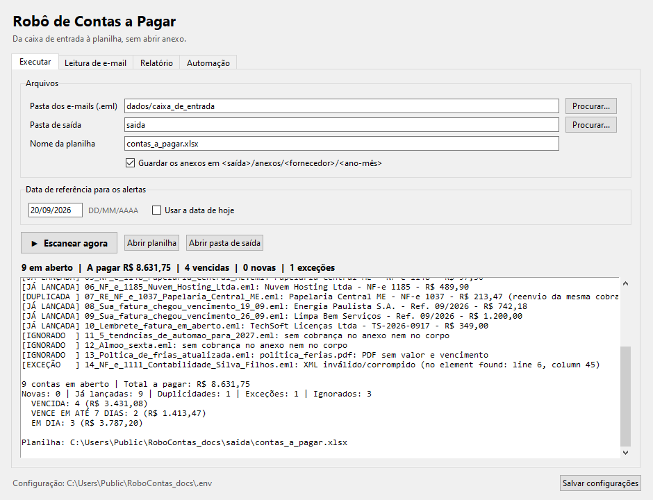
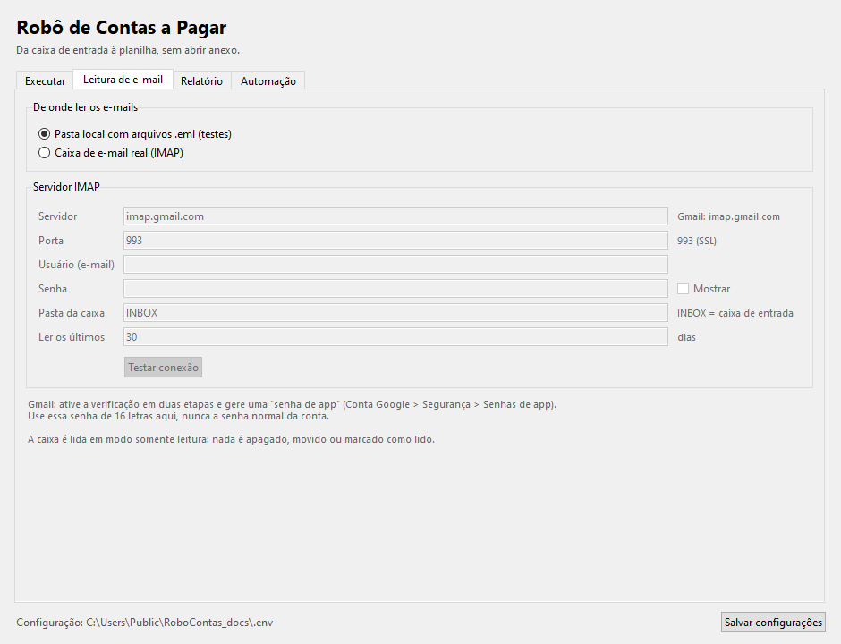
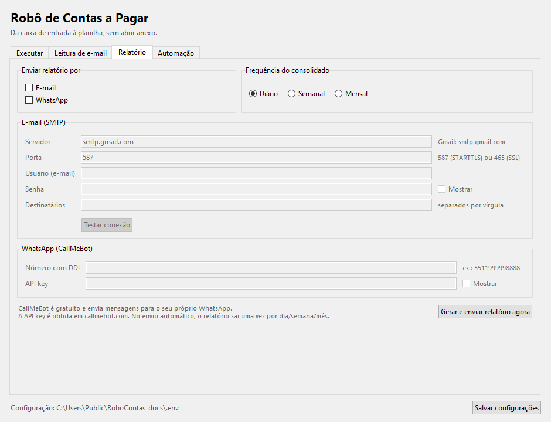
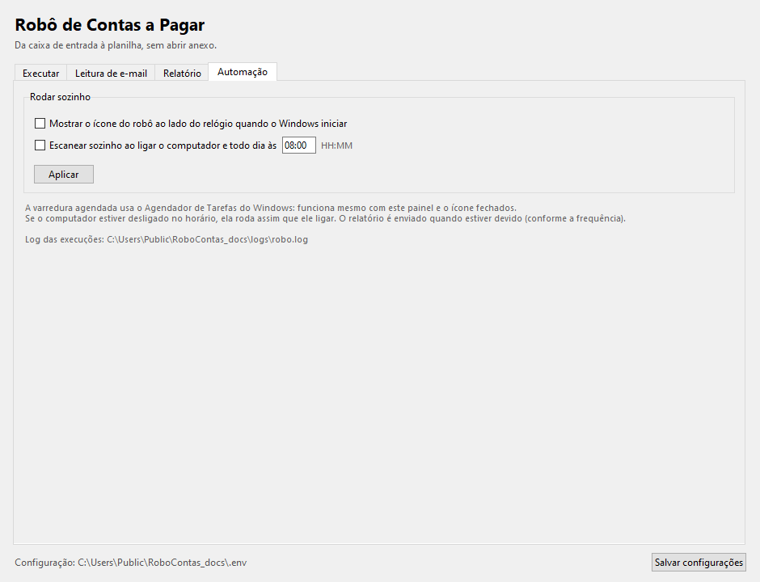
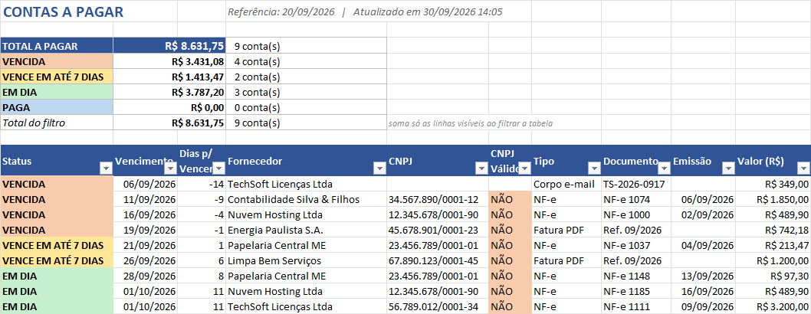
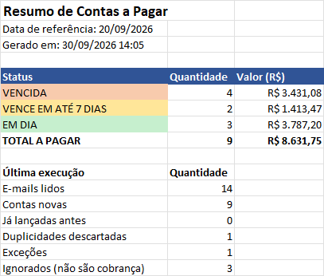
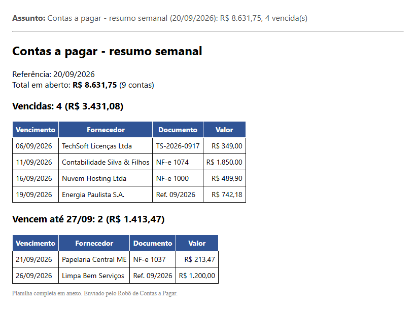

# Como usar o Robô de Contas a Pagar

Há duas formas de usar. As duas abrem o mesmo **painel** e o mesmo **ícone ao lado do relógio**. A diferença é onde os arquivos ficam.

| | **A. Usar sem instalar** | **B. Instalar** |
|---|---|---|
| Como começar | duplo clique em `Usar_sem_instalar.bat` | duplo clique em `Instalar.bat` |
| Precisa de Python | sim (3.10+) | não, só para gerar o instalador |
| Planilha e anexos | `saida\` nesta pasta | `Documentos\Contas a Pagar` |
| Configuração e log | nesta pasta (`.env`, `logs\`) | `%APPDATA%\RoboContasAPagar` |
| E-mails de teste | já vem apontando para `dados\caixa_de_entrada` | já vem apontando para os exemplos embutidos |
| Ideal para | testar, estudar, alterar o código | usar no dia a dia |

As senhas, nas duas formas, ficam no **Gerenciador de Credenciais do Windows**.

---

## A. Usar sem instalar

1. Dê **duplo clique** em `Usar_sem_instalar.bat`.
   - Na primeira vez ele instala as bibliotecas (`pip install -r requirements.txt`).
2. Abrem, juntos:
   - o **painel** (janela abaixo);
   - o **ícone do robô** ao lado do relógio (se não aparecer, clique na setinha `^` da barra de tarefas).
3. No painel, clique em **▶ Escanear agora**.

Para fechar tudo: botão direito no ícone > **Sair**, e feche a janela do painel.

## B. Instalar

1. Dê **duplo clique** em `Instalar.bat`.
   - Ele gera o programa com a versão atual do código (1 a 3 minutos) e abre o instalador.
2. No instalador, escolha as opções:
   - **Criar atalho na área de trabalho**
   - **Mostrar o ícone do robô ao iniciar o Windows**
   - **Escanear sozinho ao ligar o PC e todo dia às 08:00**
3. Ao terminar, o **painel** abre e o **ícone** aparece ao lado do relógio.

Não pede senha de administrador. Para desinstalar: *Configurações do Windows > Aplicativos > Robô de Contas a Pagar*.

Depois de instalado, o robô também fica no **menu Iniciar**:
- **Robô de Contas a Pagar**: abre o ícone (ou o painel, se o ícone já estiver aberto);
- **Robô de Contas a Pagar - Painel**: abre direto o painel.

---

## O ícone ao lado do relógio


A cor resume a situação: **verde** = tudo em dia · **amarelo** = algo vence em até 7 dias · **vermelho** = há conta vencida.

| Ação | Como |
|---|---|
| Abrir o painel | **clique** no ícone |
| Ver o resumo | passe o mouse sobre o ícone |
| Menu | **botão direito** no ícone |

```
 Abrir painel
 ─────────────────────────────
 Escanear agora
 Gerar e enviar relatório  ▸  Diário
                              Semanal
                              Mensal
 ─────────────────────────────
 Abrir planilha
 Abrir pasta de anexos
 ─────────────────────────────
 Sair
```

Ao terminar uma varredura, o Windows mostra uma notificação com o resultado.

---

## O painel

### Aba Executar

Onde ler os e-mails, onde gravar a planilha e a data usada nos alertas. O botão **Escanear agora** roda o robô e mostra o log ao vivo.



> Para testes, deixe a data em **20/09/2026** (a data do desafio). No uso real, marque **Usar a data de hoje**.

### Aba Leitura de e-mail

Escolha entre a **pasta local** (e-mails de teste) e a **caixa de e-mail real (IMAP)**. Os campos só são liberados quando a caixa real é escolhida.



> Gmail: crie uma **senha de app** (Conta Google > Segurança > Senhas de app) e use-a no campo Senha. Depois clique em **Testar conexão**.

### Aba Relatório

Marque **E-mail** e/ou **WhatsApp**, escolha a frequência e preencha os dados. O botão **Gerar e enviar relatório agora** envia na hora.



### Aba Automação

Ícone ao iniciar o Windows e varredura automática (ao ligar o PC e todo dia no horário escolhido). Clique em **Aplicar** para valer.



> Lembre de clicar em **Salvar configurações** (canto inferior direito) depois de mudar qualquer campo.

---

## A planilha

### Aba Contas a Pagar

No topo, o painel com o total a pagar e os subtotais por status; abaixo, uma linha por conta.



- **Pagou uma conta?** Preencha a coluna **Pago em** (mais à direita) e salve. Na próxima varredura ela vira `PAGA` e sai do total e dos alertas.
- **Quer ver só um fornecedor?** Use o filtro do título da coluna: o **Total do filtro** mostra a soma do que está visível.
- Feche a planilha no Excel antes de escanear: o Windows não deixa gravar num arquivo aberto.

### Aba Resumo



As abas **Exceções** (arquivos que não deu para ler, com o motivo) e **Log** (o que aconteceu com cada e-mail) completam a planilha.

---

## O relatório que você recebe

Com e-mail e/ou WhatsApp configurados na aba **Relatório**, o robô envia o consolidado na frequência escolhida: todas as contas **vencidas** e as que **vencem** nos próximos 7 dias (30 no mensal).

### Por e-mail

Vem com a planilha completa anexada.



### Por WhatsApp

```
*Contas a pagar - resumo semanal*
Referência: 20/09/2026
Total em aberto: *R$ 8.631,75* (9 contas)

*Vencidas: 4 (R$ 3.431,08)*
- 06/09 | TechSoft Licenças Ltda | R$ 349,00
- 11/09 | Contabilidade Silva & Filhos | R$ 1.850,00
- 16/09 | Nuvem Hosting Ltda | R$ 489,90
- 19/09 | Energia Paulista S.A. | R$ 742,18

*Vencem até 27/09: 2 (R$ 1.413,47)*
- 21/09 | Papelaria Central ME | R$ 213,47
- 26/09 | Limpa Bem Serviços | R$ 1.200,00
```

Os asteriscos viram **negrito** no WhatsApp.

> **Quando o relatório sai sozinho?** Uma vez por dia, semana ou mês, na primeira varredura automática depois que ele fica "devido". Se o PC ficou desligado no dia, ele sai assim que o computador ligar. O botão **Gerar e enviar relatório agora** (ou o menu do ícone) envia na hora, sem esperar.

---

## Roteiro de teste com a base de exemplo

| # | Faça | Resultado esperado |
|---|---|---|
| 1 | Apague a pasta `saida\` e clique em **Escanear agora** | 9 em aberto, **R$ 8.631,75**, 1 duplicidade, 1 exceção |
| 2 | Clique em **Escanear agora** de novo | 0 novas, 9 já lançadas; a planilha não ganha linhas |
| 3 | Preencha **Pago em** numa conta, salve, feche o Excel e escaneie | a conta vira PAGA; o total cai |
| 4 | Mude a data para **27/09/2026** e escaneie | mais contas passam a VENCIDA |
| 5 | Deixe a planilha aberta no Excel e escaneie | aviso "feche a planilha no Excel" |
| 6 | Abra o ícone e passe o mouse | resumo com total e vencidas; ícone vermelho |

Algo diferente do esperado? Veja `logs\robo.log` (forma A) ou `%APPDATA%\RoboContasAPagar\logs\robo.log` (forma B).

---

> As imagens deste guia são capturas reais do sistema rodando com a base de exemplo. Para atualizá-las depois de mudar o sistema: `python docs/gerar_ilustracoes.py`.
