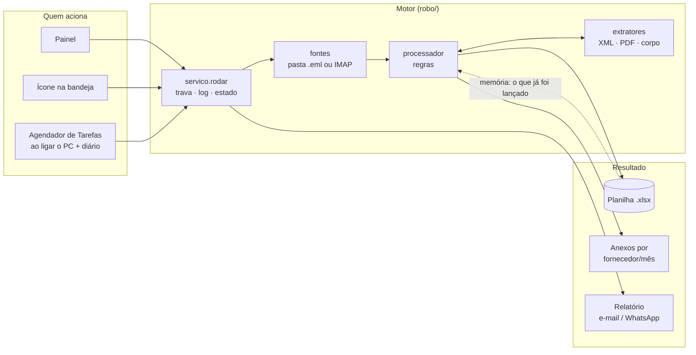
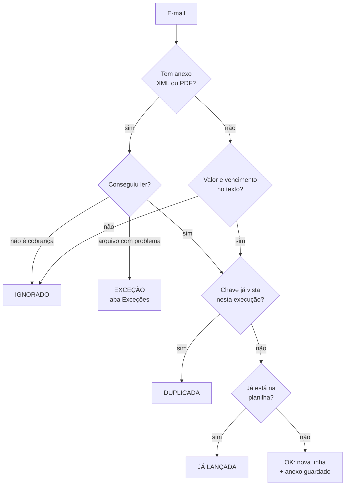

# Robô de Contas a Pagar

**Da caixa de entrada à planilha, sem ninguém abrir anexo.**

Robô em Python que lê uma caixa de e-mails, identifica as cobranças (NF-e em XML, faturas em PDF e cobranças escritas no próprio e-mail), extrai os dados, descarta duplicidades, marca o que está vencido, gera uma planilha de contas a pagar e envia um resumo por e-mail e/ou WhatsApp. Roda sozinho no Windows, com um ícone ao lado do relógio.

> Projeto do Desafio RPA #01. Status: **Níveis 1, 2 e 3 concluídos**, com painel, ícone na bandeja, agendamento e instalador para Windows. 100% Python, sem n8n.


## O problema

Toda semana alguém abre a caixa de entrada, procura o que é cobrança no meio de newsletters e conversas, baixa o XML ou o PDF, copia fornecedor, CNPJ, valor e vencimento para uma planilha e confere se a nota já não foi lançada. É repetitivo, baseado em regras e sujeito a erro: exatamente o tipo de tarefa que RPA resolve.

## O que o robô faz

1. Lê os e-mails de uma **caixa real (IMAP)** ou de uma pasta com arquivos `.eml` (testes).
2. Extrai os dados de **NF-e em XML**, **faturas/boletos em PDF** e **cobranças só no corpo do e-mail**.
3. Descarta **duplicidades** (reenvios, "RE:", lembretes de uma fatura já lançada).
4. Valida o **CNPJ** pelo dígito verificador e marca o que não bate.
5. Calcula o **status**: `VENCIDA`, `VENCE EM ATÉ 7 DIAS`, `EM DIA` ou `PAGA`.
6. Grava a planilha (abas **Contas a Pagar**, **Resumo**, **Exceções** e **Log**) e guarda os anexos em `anexos/<fornecedor>/<ano-mês>/`.
7. Envia o **relatório consolidado** (diário, semanal ou mensal) por e-mail e/ou WhatsApp.
8. Registra o destino de **cada** e-mail: `OK`, `JÁ LANÇADA`, `DUPLICADA`, `IGNORADO` ou `EXCEÇÃO`.

## Como usar

> 📘 Passo a passo com imagens de cada tela: **[COMO_USAR.md](COMO_USAR.md)**

Duas formas, com duplo clique na pasta do projeto. As duas abrem o mesmo painel e o mesmo ícone.

| | **Usar sem instalar** | **Instalar** |
|---|---|---|
| Arquivo | `Usar_sem_instalar.bat` | `Instalar.bat` |
| O que faz | roda direto do código-fonte e abre o painel e o ícone | gera o instalador com o código atual e o abre |
| Precisa de Python | sim (3.10+) | só para gerar o instalador; quem recebe o `Setup.exe` não precisa |
| Planilha e anexos | `saida\` na pasta do projeto | `Documentos\Contas a Pagar` |
| Ideal para | testar, estudar, alterar o código | usar no dia a dia |

O instalador não pede senha de administrador e pergunta se você quer atalho na área de trabalho, o ícone ao iniciar o Windows e a varredura automática todo dia às 08:00.

### O ícone ao lado do relógio


**Verde** = tudo em dia · **amarelo** = algo vence em até 7 dias · **vermelho** = há conta vencida.
**Clique** abre o painel; **botão direito** mostra o menu: *Escanear agora*, *Gerar e enviar relatório* (Diário / Semanal / Mensal), *Abrir planilha*, *Abrir pasta de anexos* e *Sair*.

### O painel

| Aba | O que tem |
|---|---|
| **Executar** | Pastas de entrada e saída, nome da planilha, guardar anexos, data de referência, **Escanear agora**, log ao vivo |
| **Leitura de e-mail** | Pasta local ou caixa IMAP; servidor, porta, usuário, senha, pasta, quantos dias ler; **Testar conexão** |
| **Relatório** | E-mail e/ou WhatsApp, frequência, dados SMTP (**Testar conexão**), WhatsApp (CallMeBot), **Gerar e enviar relatório agora** |
| **Automação** | Ícone ao iniciar o Windows; varredura ao ligar o PC e todo dia no horário escolhido |

Os campos de e-mail e WhatsApp só ficam ativos, e só são exigidos, quando a opção correspondente está marcada. Para testar com os e-mails de exemplo, nada precisa ser configurado.

## O que sai do robô

### A planilha

No topo da aba *Contas a Pagar*, um painel com o total a pagar e os subtotais por status; abaixo, uma linha por conta. Os valores do painel são **fórmulas do Excel**: acompanham qualquer edição, e o **Total do filtro** soma só as linhas visíveis ao filtrar a tabela.


Para marcar uma conta como paga, preencha a coluna **Pago em** e salve: na próxima varredura ela vira `PAGA` e sai do total e dos alertas. O robô preserva o que você escreveu.

### O relatório

Por e-mail (com a planilha anexada):


Por WhatsApp ([exemplo em texto](docs/exemplos/relatorio_whatsapp.txt)):

```
*Contas a pagar - resumo semanal*
Referência: 20/09/2026
Total em aberto: *R$ 8.631,75* (9 contas)

*Vencidas: 4 (R$ 3.431,08)*
- 06/09 | TechSoft Licenças Ltda | R$ 349,00
- 11/09 | Contabilidade Silva & Filhos | R$ 1.850,00
- 16/09 | Nuvem Hosting Ltda | R$ 489,90
- 19/09 | Energia Paulista S.A. | R$ 742,18

*Vencem até 27/09: 2 (R$ 1.413,47)*
- 21/09 | Papelaria Central ME | R$ 213,47
- 26/09 | Limpa Bem Serviços | R$ 1.200,00
```

### O log

```
[OK        ] 08_Sua_fatura_chegou_vencimento_19_09.eml: Energia Paulista S.A. - Ref. 09/2026 - R$ 742,18
[OK        ] 10_Lembrete_fatura_em_aberto.eml: TechSoft Licenças Ltda - TS-2026-0917 - R$ 349,00
[DUPLICADA ] 07_RE_NF_e_1037_Papelaria_Central_ME.eml: Papelaria Central ME - NF-e 1037 - R$ 213,47 (reenvio da mesma cobrança)
[IGNORADO  ] 13_Poltica_de_frias_atualizada.eml: politica_ferias.pdf: PDF sem valor e vencimento
[EXCEÇÃO   ] 14_NF_e_1111_Contabilidade_Silva_Filhos.eml: XML inválido/corrompido

9 contas em aberto | Total a pagar: R$ 8.631,75
Novas: 9 | Já lançadas: 0 | Duplicidades: 1 | Exceções: 1 | Ignorados: 3
```

## Como funciona

### Visão geral



Painel, ícone e agendador chamam **o mesmo motor**. A planilha também é a **memória**: antes de processar, o robô lê o que já foi lançado, e por isso rodar de novo não duplica nada.

### O caminho de cada e-mail



## Decisões tomadas

**Chave de duplicidade depende do tipo de cobrança.**
- NF-e: **CNPJ do emissor + número da nota**. Número de nota só é único dentro do mesmo emissor: nos dados há duas "NF-e 1111" de empresas diferentes. Valor também não serve: a Nuvem Hosting enviou duas notas de R$ 489,90, uma para cada mês.
- Boleto: a **linha digitável**, única por boleto.
- Cobrança no corpo: remetente + número da fatura. Se já existe a mesma cobrança (fornecedor, valor e vencimento) vinda de XML/PDF, o e-mail é tratado como lembrete e vira `DUPLICADA`.

**O corpo do e-mail só é lido quando não há anexo de cobrança.**
Quem manda fatura em PDF costuma repetir valor e vencimento no texto. Ler os dois lançaria a mesma conta duas vezes.

**Idempotência: a planilha é a memória do robô.**
Contas que já estão na planilha aparecem como `JÁ LANÇADA` e não se repetem. O status é recalculado a cada execução, e as colunas preenchidas à mão (**Pago em**) são preservadas.

**Dois tipos de "não deu", tratados de forma diferente.**
*Não é cobrança* (política de férias, newsletter) vira `IGNORADO`. *Parece cobrança, mas não deu para ler* (XML corrompido, PDF sem vencimento) vai para a aba **Exceções**, porque alguém precisa olhar.

**Um arquivo com problema não derruba o robô.**
Cada e-mail é processado dentro de um `try/except`, com uma rede de segurança final para erros inesperados.

**A caixa real é lida em modo somente leitura.**
Nada é apagado, movido ou marcado como lido: o robô não interfere em quem usa a caixa.

**O agendamento fica fora do app.**
A varredura automática usa o **Agendador de Tarefas do Windows**, e não um timer dentro do ícone. Assim funciona mesmo com o ícone fechado, e se o PC estava desligado no horário, roda assim que ligar. Uma **trava** impede que o agendador e um clique rodem ao mesmo tempo.

**Relatório "devido", não "no horário".**
O robô anota quando enviou o último relatório e envia de novo quando ainda não enviou *neste* dia, semana ou mês. Se o PC ficou desligado na segunda-feira, o semanal sai na terça.

**Senhas fora do código e fora do `.env`.**
Ficam no Gerenciador de Credenciais do Windows, protegidas pelo login do usuário.

**Instalação sem administrador.**
O instalador instala só para o usuário atual e cria o início automático e a tarefa agendada com as permissões dele.

**Por que CallMeBot para o WhatsApp?**
É gratuito e envia mensagens para o seu próprio número, suficiente para alertas pessoais. Para mandar a outras pessoas seria preciso a API oficial (Meta) ou um serviço pago como o Twilio.

## Gabarito

| Nível | Contas | Total | Resultado do robô |
|---|---|---|---|
| 1 (só XML) | 6 | R$ 6.340,57 | ✅ |
| 2 (XML + PDF) | 8 | R$ 8.282,75 | ✅ 1 duplicidade, 1 exceção |
| 3 (+ corpo do e-mail) | 9 | R$ 8.631,75 | ✅ |

Bônus: os 6 CNPJs dos dados de exemplo são fictícios e o robô os marca como **inválidos** pelo dígito verificador.

## Para desenvolvedores

### Pelo código-fonte

Requisitos: Python 3.10 ou mais recente, no Windows.

```bash
pip install -r requirements.txt
python main.py             # ícone na bandeja
python main.py --config    # painel
python executar.py         # varredura sem tela (o que o agendador chama)
```

### Linha de comando

```
RoboContas.exe                       ícone na bandeja (se já aberto, abre o painel)
RoboContas.exe --config              painel
RoboContas.exe --executar            varre e envia o relatório se estiver devido
RoboContas.exe --relatorio semanal   varre e envia o relatório agora
RoboContas.exe --agendar 08:00       cria a tarefa agendada
RoboContas.exe --desagendar          remove a tarefa agendada
RoboContas.exe --inicio sim|nao      ícone ao iniciar o Windows
```

(Pelo código-fonte, troque `RoboContas.exe` por `python main.py`.)

### Onde ficam os arquivos

| | Pelo código-fonte | Instalado |
|---|---|---|
| Programa | pasta do projeto | `%LOCALAPPDATA%\Programs\RoboContas` |
| Configuração (`.env`), log, estado | pasta do projeto | `%APPDATA%\RoboContasAPagar` |
| Planilha e anexos | `saida/` | `Documentos\Contas a Pagar` |
| Senhas | Gerenciador de Credenciais do Windows (`RoboContasAPagar`) | idem |

No Gmail, use uma **senha de app** (Conta Google > Segurança > Senhas de app), nunca a senha normal da conta.

### Gerando o instalador

```powershell
powershell -ExecutionPolicy Bypass -File instalador\build.ps1
```

1. **PyInstaller** gera `instalador\dist\RoboContas\RoboContas.exe`, com Python e bibliotecas embutidos.
2. **Inno Setup 6** (`winget install JRSoftware.InnoSetup`) gera `instalador\saida\Setup_RoboContas_1.0.0.exe`.

### Atualizando as imagens da documentação

```bash
python docs/gerar_ilustracoes.py
```

Roda o robô com a base de exemplo numa pasta isolada e recaptura as telas do painel, a planilha (via Excel), o e-mail do relatório (via Edge) e os ícones.

### Estrutura

```
.
├── Usar_sem_instalar.bat    # duplo clique: roda do código-fonte
├── Instalar.bat             # duplo clique: gera e abre o instalador
├── COMO_USAR.md             # guia com imagens
├── main.py                  # ponto de entrada (vira RoboContas.exe)
├── app.py                   # painel (tkinter)
├── executar.py              # execução sem tela (agendador/terminal)
├── robo/
│   ├── config.py            # caminhos, .env e cofre de senhas
│   ├── fontes.py            # e-mails da pasta ou da caixa IMAP
│   ├── extratores.py        # NF-e (XML), fatura (PDF), corpo, CNPJ
│   ├── processador.py       # regras: duplicidade, status, exceções, anexos
│   ├── planilha.py          # leitura (memória) e gravação do .xlsx
│   ├── relatorio.py         # relatório consolidado e envio
│   ├── servico.py           # trava, log em arquivo, estado, execução
│   ├── bandeja.py           # ícone ao lado do relógio
│   ├── sistema.py           # início com o Windows e Agendador de Tarefas
│   └── conexoes.py          # testes de login IMAP e SMTP
├── instalador/
│   ├── build.ps1            # gera o .exe e o instalador
│   ├── RoboContas.iss       # script do Inno Setup
│   └── gerar_icone.py
├── docs/
│   ├── img/                 # capturas de tela e ícones
│   ├── exemplos/            # relatório de exemplo (HTML e WhatsApp)
│   └── gerar_ilustracoes.py # recaptura tudo
├── historico/
│   └── robo_nivel1.py       # primeira versão (Nível 1), mantida para estudo
├── requirements.txt
├── .env.example
└── dados/
    ├── gerar_dados.py       # gera os e-mails de exemplo
    └── caixa_de_entrada/    # 14 e-mails .eml
```
